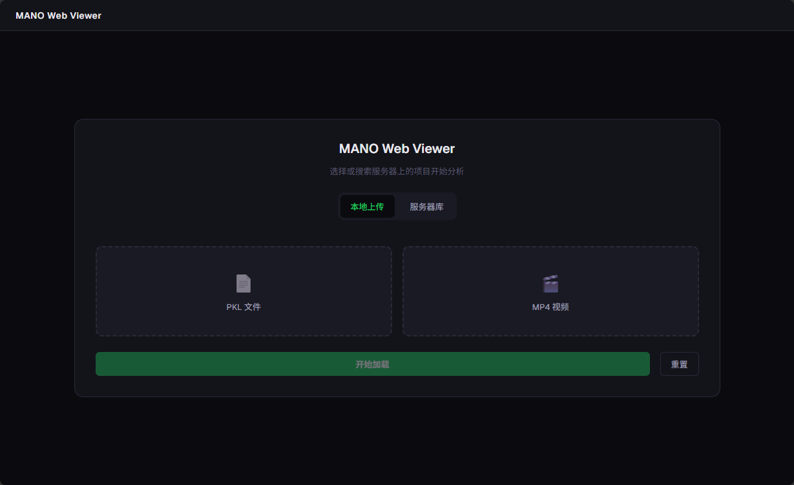
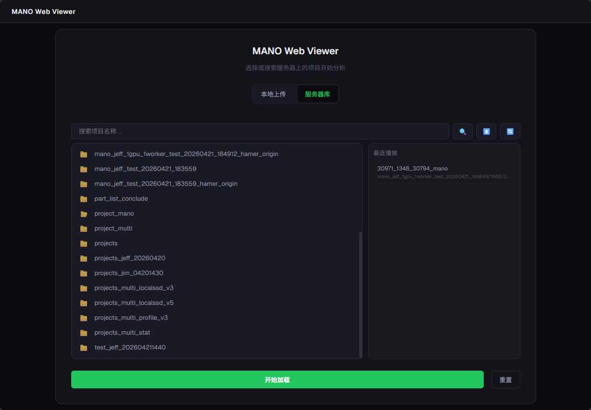

# MANO Web Viewer


Web 端 MANO PKL 手部模型可视化检查工具。




## 项目结构

```
├── apps/
│   ├── frontend/  # Next.js 前端 (TypeScript + React Three Fiber)
│   └── backend/   # FastAPI 后端 (Python)
├── public/mock/   # 测试数据
└── docs/          # PRD 文档
```

## 快速开始

### 本地开发

#### 前端

```bash
cd apps/frontend
npm install
npm run dev
```

#### 后端

```bash
cd apps/backend
pip install -r requirements.txt```bash
uvicorn main:app --reload --port 8000
```

```

```

### Docker 部署

项目支持生产环境 (`prod`) 和测试环境 (`test`) 的并行部署。

#### 1. 环境配置文件

在根目录下已经准备了两个环境配置文件：

- **`.env.prod`**: 生产环境配置（默认端口：18080/18000）。
- **`.env.test`**: 测试环境配置（默认端口：18081/18001）。

您可以根据服务器 IP 修改文件中的 `HOST_IP` 和 `NEXT_PUBLIC_API_URL`。

#### 2. 一键部署/停止脚本

推荐使用提供的部署脚本，它会自动处理环境变量加载并隔离容器组（使用不同的项目名称）。

**Linux 环境：**

```bash
# 启动/更新环境
./deploy.sh test  # 测试环境
./deploy.sh prod  # 生产环境

# 停止环境
./deploy.sh test down
./deploy.sh prod down
```

#### 3. 访问方式

根据配置文件的设置，访问地址如下：

- **生产环境 (Prod)**：
  - 前端：`http://${HOST_IP}:18080`
  - 后端：`http://${HOST_IP}:18000`
- **测试环境 (Test)**：
  - 前端：`http://${HOST_IP}:18081`
  - 后端：`http://${HOST_IP}:18001`

#### 4. 手动管理命令 (Docker Compose)

如果不使用脚本，必须通过 `-p` 参数指定项目名称，否则无法正确管理容器：

```bash
# 启动测试环境
docker-compose --env-file .env.test -p mano-viewer-test up -d --build

# 停止测试环境
docker-compose -p mano-viewer-test down

# 停止生产环境
docker-compose -p mano-viewer-prod down
```

---

#### 远程访问提示 (SSH Tunnel)

如果服务器防火墙限制了端口访问，可以在本地终端使用 SSH 隧道映射端口：

```bash
# 在本地电脑执行（以生产环境为例）
ssh -L 18080:localhost:18080 -L 18000:localhost:18000 ubuntu@10.60.202.97
```

映射后，即可通过 [http://localhost:18080](http://localhost:18080) 访问。
